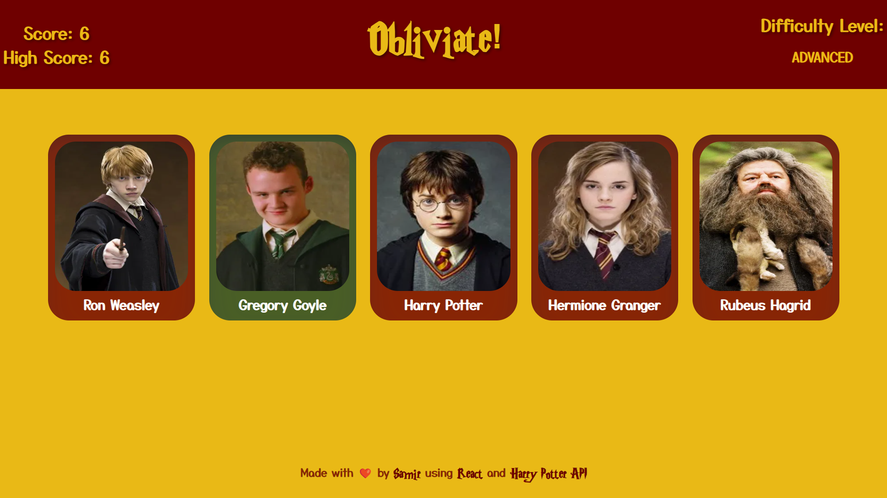

# Obliviate!

### This is a simple memory game created using React and the Harry Potter API.

The game is simple, click on a character to earn points, but don't click on the same character twice or you lose!

[Pages Deployment]

<table>
  <td align="center"><b>Made using:</b></td>
  <td> 
    
    
    
    
    
    
  </td>
</table>

###### Additional libraries used: eslint [for react], prop-types, uuid [For key generation]

## **Click on the pictures/the link below to try!**

## [Click to open](https://redplusblue.github.io/memory-game/)

## Features:

1. Randomly generated characters from the Harry Potter API.
2. Score and high score tracking.
3. Advanced gamemode with randomised character card numbers and positions.
4. Simple and clean UI.

## What I used/learned:

- React: useEffect, useState.
- Using effects to fetch data from an API, and running functions when a state changes.

### What I did well:

- I think the game is quite fun and challenging, and the UI is clean and simple.
- All API interactions are handled using useEffect, and no data is stored in the app.

### Problems I faced:

1. I had to use a different API than the one I wanted to use, as the original API was not working properly.
2. I had some other responsibilities to take care of, so I had to take a break from the project for a while, starting over led to a lot of refactoring.

 

###### An exercise for [TheOdinProject](theodinproject.com)
